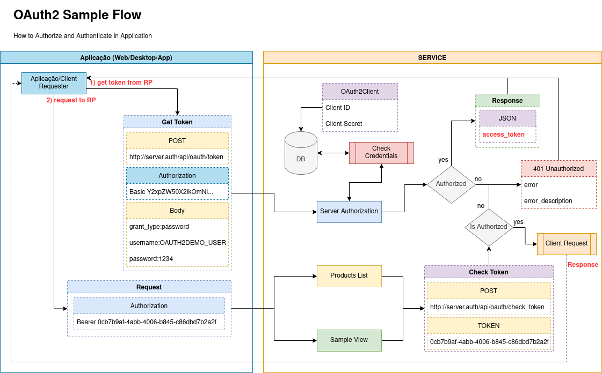

# OAUTH2 CLIENT+SERVER+RESOURCE DEMO
This is a demo project

# Resources

* Java 8 (jdk-8u212)
* Spring Boot 2.0.1.RELEASE
* Maven Project

# Dependencies

* Lombok 
* Spring Data JPA 
* Mysql Driver 
* Spring Rest Docs 
* Spring Web 
* Rest Repositories 
* Rest Template (Client)
* OAUTH2 (Server and Client)

---

<h4>Details</h4>
<pre>
- Linux Ubuntu 20.04 LTS

JDK
$ javac -version
javac 11.0.13

JRE
$ java -version
openjdk version "11.0.13" 2021-10-19
OpenJDK Runtime Environment (build 11.0.13+8-Ubuntu-0ubuntu1.20.04)
OpenJDK 64-Bit Server VM (build 11.0.13+8-Ubuntu-0ubuntu1.20.04, mixed mode, sharing)
</pre>

<pre>
- Windows 10 PRO

INSTALLERS
jdk-8u212-windows-x64.exe
jre1.8.0_212-windows-x64.exe (automatic download by jdk)

JDK
$ javac -version
javac 1.8.0_212

JRE
$ java -version
java version "1.8.0_212"
Java(TM) SE Runtime Environment (build 1.8.0_212-b10)
Java HotSpot(TM) 64-Bit Server VM (build 25.212-b10, mixed mode)
</pre>

---------------------------------------------------------------------------------------------------

# OAUTH2

> How to authorize access via OAUTH2

To perform authentication and authorization via OAUTH2, follow the instructions below (as shown in the image):

1- Configure the REQUEST URL as needed, example: [GET] http://localhost:56500/huntercodexs/api/v1/samples

2- Click on the Authorization tab of the REQUEST 

3- Choose as in Request Type OAuth 2.0

4- Choose in "Add authorization data to" the value Request Headers

5- In Header Prefix, enter the Bearer value

6- In Grant Type choose Password Credentials

7- In access token URL, enter the URL where the OAUTH2 service is running and managing the tokens, for example: http://localhost:31303/huntercodexs/api/rest/oauth/v1/oauth/token

8- In Client ID, enter the id of the client that is previously registered in the system or service, for example: client_auth_id

9- In Client Secret, enter the secret that the client must use to authenticate in the API

10- In Username, enter the username, for example: OAUTH2DEMO_USER

11- In Password, enter the user's access password, for example: 1234567890

12- In Client Authentication choose "Send as Basic Auth header"

13- Click on the "Get New Access Token" button

14- Synchronize the token generated in the application environment by including the token in the Request Header

> Below we have the flow diagram to guide the operation of OAuth2.

