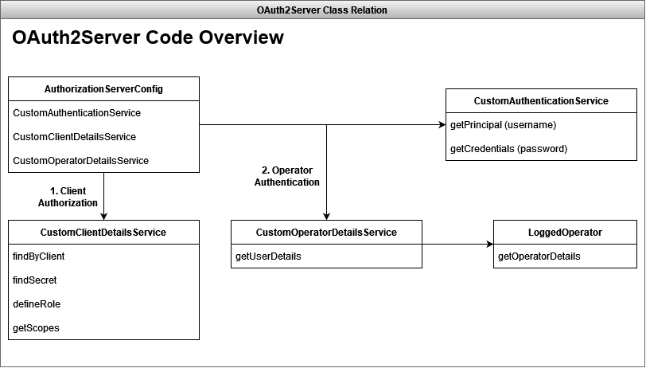
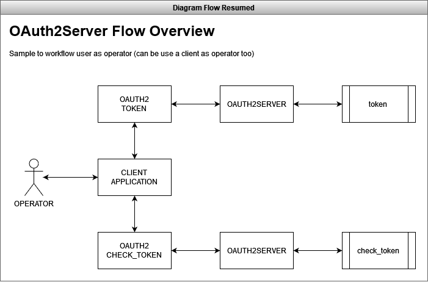

# OAUTH2 SERVER DEMO
Just an authorization and authentication server

----

# Resources

* MVC
* Maven Project
* Java 8 (jdk-8u212)
* Spring Boot 2.0.1.RELEASE

----

# Dependencies

* Lombok
* Spring Data JPA
* Mysql Driver Connector
* Spring Rest Docs
* Spring Web
* OAuth2
* Service Discovery
* Zipkin
* Prometheus
* ELK

----

<h4>Details</h4>
<pre>
JDK
$ javac -version
javac 1.8.0_212

JRE
$ java -version
java version "1.8.0_212"
Java(TM) SE Runtime Environment (build 1.8.0_212-b10)
Java HotSpot(TM) 64-Bit Server VM (build 25.212-b10, mixed mode)
</pre>

---------------------------------------------------------------------------------------------------

# Overview

> About

This project only can be used as the Authorization Server OAuth2.

It will generate the access_token and make a check in this token according the client request in a runtime.

Use this project to manager your application security as an external resource.

Below we have the flow diagram to guide the operation of OAuth2 Server.

> Diagrams

- Classes Relation Overview

- Diagram Flow Resumed

- Diagram Flow Detailed

- Diagram of Sequence

> How to use

Please, before starting this project have sure that the steps is already completed:

- Create the database: demo
- Create the tables and insert data into database demo from file: src/main/resources/database.sql
- Check if the Service Discovery is available to register
- Use the postman file as support to make a tests

---------------------------------------------------------------------------------------------------

# Postman

> Use the postman file to make tests

src/main/resources/OAUTH2-SERVER-DEMO.postman_collection.json

> In this postman file exists two Requests

- Get Token
  - http://localhost:33100/api/rest/oauth/v1/oauth/token
- Check Token
  - http://localhost:33100/api/rest/oauth/v1/oauth/check_token

---------------------------------------------------------------------------------------------------

# About the OAuth2

> How to authorize access via OAuth2 using Postman

To perform authentication and authorization via OAUTH2, follow the instructions below (as shown in the image):

1- Configure the REQUEST URL as needed, example: [GET] http://localhost:33080/huntercodexs/api/v1/samples

2- Click on the Authorization tab of the REQUEST

3- Choose as in Request Type OAuth 2.0

4- Choose in "Add authorization data to" the value Request Headers

5- In Header Prefix, enter the Bearer value

6- In Grant Type choose Password Credentials

7- In access token URL, enter the URL where the OAUTH2 service is running and managing the tokens, for example: http://localhost:31303/huntercodexs/api/rest/oauth/v1/oauth/token

8- In Client ID, enter the id of the client that is previously registered in the system or service, for example: client_auth_id

9- In Client Secret, enter the secret that the client must use to authenticate in the API

10- In Username, enter the username, for example: OAUTH2DEMO_USER

11- In Password, enter the user's access password, for example: 1234567890

12- In Client Authentication choose "Send as Basic Auth header"

13- Click on the "Get New Access Token" button

14- Synchronize the token generated in the application environment by including the token in the Request Header

------------------------------------------------------------------------------------------------------------------------

> TIPS
> 
> Use the OAUTH2-SERVER-DEMO.postman_collection.json file to speed up development and test

- When starting the microservice, the AuthorizationServerConfig class is executed, which prepares the server environment
  OAuth2 to receive token generation and authentication requests using the generated token.

- After the microservice is ready to receive requests, any client or application can make a request
  to generate an OAuth2 token via the url http://localhost:33100/api/rest/oauth/v1/oauth/token

- It is possible to validate the generated token through the url http://localhost:33100/api/rest/oauth/v1/oauth/check_token, that is,
  the application or the client can ask the OAuth2 Server to verify that the token used is valid

# Application/Client Enrollment

------------------------------------------------------------------------------------------------------------------------

The application/client must be registered in the OAuth2Server system using the following data/fields:

<pre>
id: automatic
client: Referring to the username of the client/application, ex: aws, client_id
secret: Refers to the client/application secret, ex: cbfc5654-3333-4abb-9999-abddd8fa1bec
scope: Refers to the scope of the client, ex: read-write
accessTokenValiditySeconds: Refers to the token validity time
refreshTokenValiditySeconds: Refers to the expiration time of the access token refresh token
</pre>

- Example

> Table: authorization_oauth2_server

|id |accessTokenValiditySeconds|client   | secret                                           |refreshTokenValiditySeconds|
|---|--------------------------|---------|--------------------------------------------------|---------------------------|
|1  |6,000                     |client_id| YzQ0NDQ0NC0wN2NkLTMzMzMtMjM0Ni1henNkZDhmYTFiZWM= |9,000                      |

# Operator(Client/user) Enrollment

------------------------------------------------------------------------------------------------------------------------

To register the operator in the OAuth2Server system, it is necessary to have the following information:

<pre>
id: automatic
username: Refers to the client/user operator, ex: OAUTH2_USER, OATUH2_CLIENT
password: Refers to the client/user operator, ex: 12345
role: Refers to the type of operator, ex: ROLE_ADMIN, ROLE_USER, ROLE_CLIENT
email: Refers to the operator's email
deleted: Indicates whether the operator has been deleted
status: Indicates whether the operator is active
</pre>

- Example

> Table: operator_oauth2_server

|id |username         |password  |role       |email|deleted|status|
|---|-----------------|----------|-----------|-----|-------|------|
|1  |OAUTH2DEMO_ADMIN |1234567890|ROLE_ADMIN |     |0      |1     |
|2  |OAUTH2DEMO_USER  |1234567890|ROLE_USER  |     |0      |1     |
|2  |OAUTH2DEMO_CLIENT|1234567890|ROLE_CLIENT|     |0      |1     |

# Flow (Configuration)

------------------------------------------------------------------------------------------------------------------------

<pre>
-> Run
    -> AuthorizationServerConfig
        -> CustomAuthenticationService
        -> CustomClientDetailsService
        -> CustomOperatorDetailsService
</pre>

> INFO

- At this stage of execution, OAuth2 prepares the environment to receive requests, both from clients
  as well as the applications that are integrated with the authorizing/authenticator system.

- However, the client or application must be registered/integrated with the OAuth2Server using a
  username(clientId) and a password(secret).

- It is also necessary that the credentials of the user, who is using the application/client integrated to the OAuth2Server,
  is registered in OAut2Server to perform user or client authentication, at this point you must use
  ROLES for each OPERATOR type, ie CLIENT and USER commonly referred to as ROLE_USER and ROLE_CLIENT.

- The entire flow is automated through configurations made in the AuthorizationServerConfig class, which knows
  when to call the CustomAuthenticationService class for user authentication, and when to call the class
  CustomClientDetailsService to authorize a client built into your system.

# Flow (Token Generate)

------------------------------------------------------------------------------------------------------------------------

<pre>
-> Request
    -> CustomClientDetailsService
        -> CustomAuthenticationService
            -> CustomOperatorDetailsService
</pre>

> INFO

- To generate an OAuth2 token it is necessary to send a request to the OAuth2Server through the url
  http://localhost:33100/api/rest/oauth/v1/oauth/token

- At this stage, the authorization that the client/application has to use the token must be sent along with the token request.
  OAuth2Server, and this authorization must be sent in the HEADER of the request in the Authorization field with the method
  Basic Auth authorization, and this information must have a separate username and password in its content
  by 2 dots "username:password" encoded with base64, for example: Y2xpZW50X2lkOmM0NDQ0NDQtMDdjZC0zMzMzLTIzNDYtYXpzZGQ4ZmExYmVj

- Still at this stage of the process, the operator's credentials must be sent along with the request, whether a client or
  a user by parameters contained in the BODY or as QUERY_STRING, however using the HTTP POST Method, for example:

<pre>
REQUEST: POST http://localhost:33100/api/rest/oauth/v1/oauth/token
REQUEST: POST http://localhost:33100/api/rest/oauth/v1/oauth/token?grant_type:password&username:OAUTH2DEMO_USER1&password:123456789
HEADER: Authorization: Y2xpZW50X2lkOmM0NDQ0NDQtMDdjZC0zMzMzLTIzNDYtYXpzZGQ4ZmExYmVj
BODY: 
    grant_type:password
    username:OAUTH2DEMO_USER1
    password:1234567890
</pre>

A response in JSON format will be returned containing the following structure:

<pre>
{
    "access_token": "f5d0433f-6d04-4c5a-aa08-4573f4917a3e",
    "token_type": "bearer",
    "refresh_token": "23435be3-defe-45de-b38d-d10284c8a6d7",
    "expires_in": 3599,
    "scope": "read write"
}
</pre>

where the access_token field should be stored for later use. We also have the refresh_token field that can be
used to renew the current token.

- If the authorization is incorrect, the following response will be returned:

<pre>
{
    "timestamp": 1665351187078,
    "status": 401,
    "error": "Unauthorized",
    "message": "Unauthorized",
    "path": "/api/rest/oauth/v1/oauth/check_token"
}
</pre>

- If there is a problem related to the client/user operator, the following response will be returned:

<pre>
//GRANT TYPE
{
    "error": "unsupported_grant_type",
    "error_description": "Unsupported grant type: password1"
}

//OPERATOR
{
    "error": "invalid_grant",
    "error_description": "Credentials Fail: Not Found Operator"
}

//PASSWORD
{
    "error": "invalid_grant",
    "error_description": "Credentials Fail: Invalid Credentials"
}
</pre>

# Flow (Token Validate)

------------------------------------------------------------------------------------------------------------------------

<pre>
-> Request
    -> CustomClientDetailsService
</pre>

> INFO

- When there is a need to validate the token, you can use the url/endpoint
  http://localhost:33100/api/rest/oauth/v1/oauth/check_token passing the token in the body of the type request
  HTTP POST and also the authorization of the client/application in the HEADER of the Basic Auth type request, example:

<pre>
REQUEST: POST http://localhost:33100/api/rest/oauth/v1/oauth/check_token
HEADER: Authorization: Y2xpZW50X2lkOmM0NDQ0NDQtMDdjZC0zMzMzLTIzNDYtYXpzZGQ4ZmExYmVj
BODY: token=f5d0433f-6d04-4c5a-aa08-4573f4917a3e
</pre>

- The OAuth2Server automated system will perform the token validation using the authorization, which
  contains information about the client as client_id/secret, returning a response in JSON format that looks like this:

<pre>
{
    "aud": [
        "oauth2-resource"
    ],
    "user_name": "OAUTH2DEMO_USER",
    "scope": [
        "read",
        "write"
    ],
    "active": true,
    "exp": 1665351337,
    "authorities": [
        "ROLE_USER"
    ],
    "client_id": "client_id"
}
</pre>

- If the token is invalid, the following response will be returned:

<pre>
{
    "error": "invalid_token",
    "error_description": "Token was not recognised"
}
</pre>

- If the client/application authorization is not correct, the OAuth2Server will return the following response:

<pre>
{
    "timestamp": 1665351187078,
    "status": 401,
    "error": "Unauthorized",
    "message": "Unauthorized",
    "path": "/api/rest/oauth/v1/oauth/check_token"
}
</pre>
